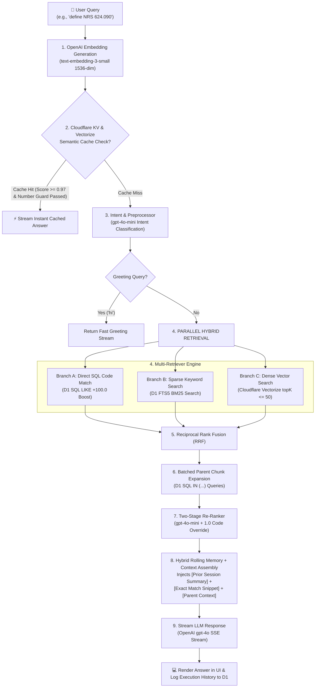

# 🌐 KnowledgeHubAI — Edge-Native Enterprise RAG Platform

> **100% Cloudflare Stack**: Cloudflare Workers, D1 SQLite Database, Vectorize Vector DB, KV Storage, Workers Assets, and OpenAI GPT-4o.

[](https://knowledgehubai-frontend.hassanwaqar475.workers.dev)
[](https://knowledgehubai-frontend.hassanwaqar475.workers.dev)

🚀 **Live Web Application**: [https://knowledgehubai-frontend.hassanwaqar475.workers.dev](https://knowledgehubai-frontend.hassanwaqar475.workers.dev)

---

## 📑 Table of Contents

- [Overview](#-overview)
- [Key Features](#-key-features)
- [Architecture & Flow](#-architecture--flow)
- [Tech Stack](#-tech-stack)
- [Project Structure](#-project-structure)
- [Getting Started](#-getting-started)
- [Deployment](#-deployment)
- [License](#-license)

---

## 💡 Overview

**KnowledgeHubAI** is an enterprise-grade Retrieval-Augmented Generation (RAG) platform rebuilt from the ground up to run natively on **Cloudflare's Global Edge Network**. By migrating from traditional Node.js/MongoDB infrastructure to Cloudflare Workers, D1 SQLite, and Vectorize, KnowledgeHubAI delivers **sub-millisecond startup times**, **zero cold starts**, and sub-second token-by-token streaming responses worldwide.

---

## ✨ Key Features

### 🔍 1. Hybrid Multi-Retriever Engine (Dense + Sparse + RRF)
- **Dense Vector Search**: Queries Cloudflare Vectorize (`topK <= 50`) using 1536-dimensional `text-embedding-3-small` embeddings.
- **Sparse Keyword Search**: Queries Cloudflare D1 SQLite `chunks_fts` (FTS5 BM25 search).
- **Exact Section Code Boosting**: Detects legal statute codes (e.g. `NRS 624.090`, `NAC 624.170`) and executes a direct SQL `LIKE` lookup in D1, granting matched chunks an instant **`+100.0` score boost**.
- **Reciprocal Rank Fusion (RRF)**: Merges dense, sparse, and exact matches into a single unified candidate pool.

### 🧠 2. Hybrid Rolling Memory Engine (Short-Term + Long-Term Summary)
- **Verbatim Short-Term Memory**: Keeps the most recent 6 exchanges (12 message turns) verbatim for immediate conversational fluency and pronoun resolution.
- **Rolling Long-Term Summary**: When a session exceeds 6 exchanges, preceding messages are automatically summarized into a 2-3 sentence `Prior Session Context` block using `gpt-4o-mini` and persisted in D1 (`session_summaries`).
- **Zero Added Latency**: Summarization runs asynchronously in background execution, injecting long-term user facts and background context into the GPT-4o prompt without slowing down user responses.

### 🌳 3. Adaptive 3-Tier Tree Chunker
- **AI Document Classification**: Uses `gpt-4o-mini` to classify documents into `FAQ`, `Table`, `Clause`, or `Standard`.
- **Tree Hierarchy**: Constructs a 3-tier parent-child tree linked in D1:
  - **Large Parent Chunks (~1,000 tokens)**: Captures complete section/paragraph context.
  - **Medium Chunks (~400 tokens)**: Intermediate tree nodes.
  - **Small Child Chunks (~150 tokens)**: High-precision leaf vectors indexed into Cloudflare Vectorize.

### 📜 4. Table of Contents Bypass & Snippet Prepending
- Prepends exact matched child snippets directly to the parent context (`[Exact Match Snippet]: ... \n\n [Full Parent Context]: ...`), guaranteeing the LLM sees the exact definition text even if the parent chunk starts in a Table of Contents index.

### 🎯 5. Two-Stage Re-Ranker with Section Code Override
- Scores candidates using `gpt-4o-mini` as a cross-encoder judge.
- Any passage containing the exact section code requested receives an instant **`1.0` answerability score override**, blending 60% retrieval confidence with 40% Cross-Encoder scoring.

### 🛡️ 6. Semantic KV Cache & Entity Guard
- Caches queries in Cloudflare KV.
- `extractNumbersAndCodes()` compares section numbers between current and cached queries. If section numbers differ (e.g., `624.150` vs `624.170`), the cache is bypassed to eliminate false hits.

### 🕸️ 7. Enterprise Web Crawler
- **Crawl Modes**: Single Page, Domain Deep Crawl (Breadth-First Link Discovery), and Sitemap.xml Auto-Discovery.
- **Politeness Rate-Limiting**: 200ms delay between page fetches to avoid IP blocks.
- **Content Hash Checksum**: SHA-256 deduplication skips re-indexing unchanged web content.

### 📊 8. User-Centric Hierarchical Audit Explorer & Diagnostics
- **3-Level Drill-Down Structure**: 
  - `Level 1`: Registered Users Directory (User email, total sessions, total query count, last active date).
  - `Level 2`: User Sessions Explorer (All chat sessions created by the selected user).
  - `Level 3`: Session Transcript & Pipeline Diagnostics Inspector.
- **Interactive Inspect Pipeline Modal**: Inspects stage-by-stage latency breakdowns (Embedding, Retrieval, Re-ranking, LLM), query transformations (Original vs Rewritten Query), and cited source chunks with relevance scores.

---

## 🏗️ Architecture & Flow



---

## 🛠️ Tech Stack

- **Compute Runtime**: [Cloudflare Workers](https://workers.cloudflare.com/) (Hono Framework)
- **Frontend SPA**: [React](https://react.dev/) + [Vite](https://vitejs.dev/) (Deployed via Cloudflare Workers Assets)
- **Relational Database**: [Cloudflare D1](https://developers.cloudflare.com/d1/) (Serverless SQLite)
- **Vector Database**: [Cloudflare Vectorize](https://developers.cloudflare.com/vectorize/) (1536-dim vector index)
- **Key-Value Cache**: [Cloudflare KV](https://developers.cloudflare.com/kv/)
- **Object Storage**: [Cloudflare R2](https://developers.cloudflare.com/r2/) (Raw PDF/DOCX storage)
- **AI Models**: OpenAI `gpt-4o`, `gpt-4o-mini`, and `text-embedding-3-small`
- **CLI & Deployment**: Cloudflare `wrangler` CLI

---

## 📂 Project Structure

```
knowledgehubai-cloudflare/
├── frontend/                     # React + Vite Single Page Application
│   ├── src/
│   │   ├── components/           # Navbar, ErrorBoundary, Glass Cards
│   │   ├── context/              # AuthContext (JWT Authentication & API wrapper)
│   │   ├── pages/                # ChatPage, IngestionManager, CrawlerManager, AdminDashboard
│   │   └── App.jsx               # Application Router & Navigation
│   └── wrangler.jsonc            # Cloudflare Workers Assets configuration
│
└── worker/                       # Cloudflare Worker Edge Server
    ├── src/
    │   ├── index.ts              # Worker entry point & Hono Router
    │   ├── routes/               # API Routes (/auth, /query, /documents, /crawl, /admin)
    │   ├── services/             # Core Logic (Pipeline, Ingestion, Crawl, Summary, Auth, Analytics)
    │   ├── retrievers/           # Multi-Retriever (Dense Vectorize + Sparse D1 FTS5 + RRF)
    │   ├── rankers/              # Two-Stage Cross-Encoder Re-ranker
    │   ├── chunkers/             # Adaptive Tree Chunker (3-tier hierarchy)
    │   ├── processors/           # WASM Document Parsers (PDF, DOCX, Excel, CSV, PPTX, Image OCR)
    │   ├── cache/                # Cloudflare KV Cache Manager
    │   └── db/queries.ts         # D1 SQLite Database Queries
    └── wrangler.jsonc            # Cloudflare Worker bindings configuration
```

---

## 🚀 Getting Started

### Prerequisites
- [Node.js](https://nodejs.org/) v18+
- Cloudflare Account & [Wrangler CLI](https://developers.cloudflare.com/workers/wrangler/install-and-update/) installed

### 1. Local Installation

```bash
# Clone the repository
git clone https://github.com/HassanCpp/knowledgehubai-cloudflare.git
cd knowledgehubai-cloudflare

# Install Worker dependencies
cd worker
npm install

# Install Frontend dependencies
cd ../frontend
npm install
```

### 2. Configure Cloudflare Secrets & Database

```bash
cd ../worker

# Set your OpenAI API Key in Cloudflare Worker secrets
npx wrangler secret put OPENAI_API_KEY

# Execute D1 Schema Migration
npx wrangler d1 execute knowledgehubai --remote --file=./schema.sql
```

### 3. Run Locally

```bash
# Start Worker local development server
cd worker
npx wrangler dev

# Start Frontend local dev server (in another terminal)
cd ../frontend
npm run dev
```

---

## 📤 Deployment

Deploy both backend Worker and frontend Assets to Cloudflare globally in seconds:

```bash
# Deploy Backend Worker
cd worker
npx wrangler deploy

# Build & Deploy Frontend Assets
cd ../frontend
npm run build
npx wrangler deploy
```

---

## 🔗 Live Application

🌐 **Live URL**: [https://knowledgehubai-frontend.hassanwaqar475.workers.dev](https://knowledgehubai-frontend.hassanwaqar475.workers.dev)

---

## 📄 License

This project is licensed under the MIT License.
