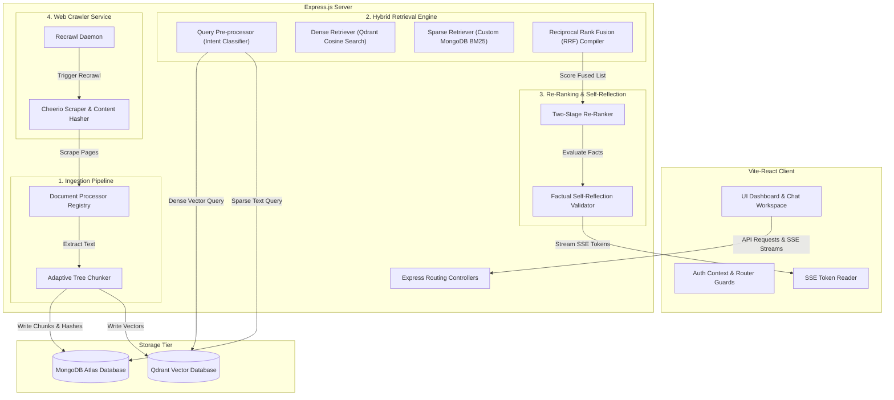
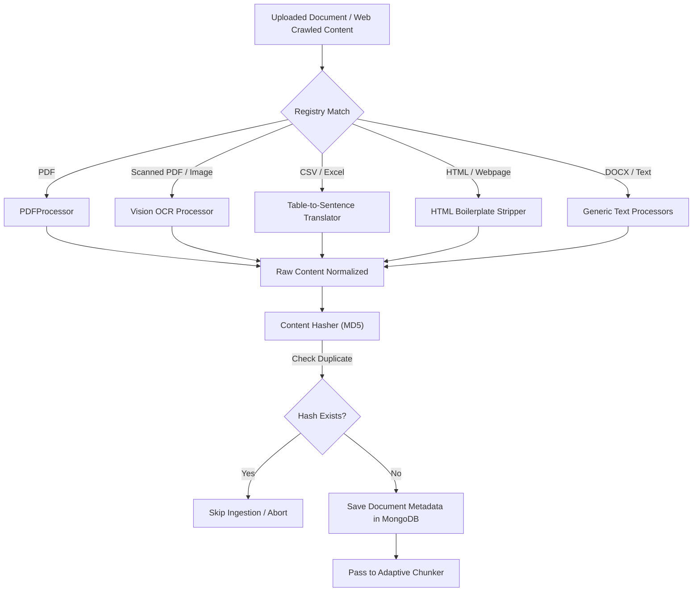
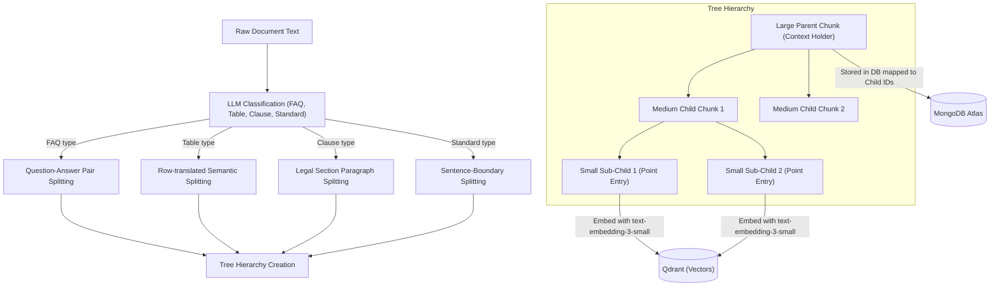
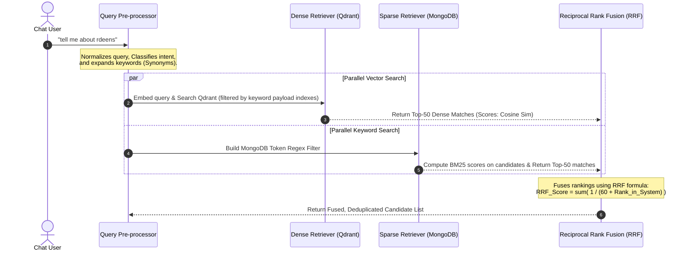
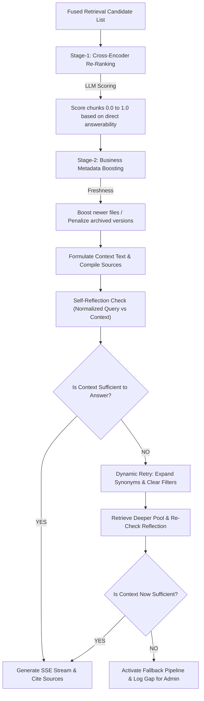

# KnowledgeHubAI Architectural Flow Guide

This document details the production-quality, modular architecture of the **KnowledgeHubAI** Retrieval-Augmented Generation (RAG) platform. The system is designed around Clean Architecture principles, completely avoiding framework wrappers like LangChain or LlamaIndex to ensure maximum performance, predictability, and fine-grained algorithmic control.

---

## 1. High-Level System Architecture

The platform consists of a Vite-React frontend communicating with an Express.js backend. State storage is split between **MongoDB Atlas** (transactional metadata, user sessions, chat history, raw document chunks) and **Qdrant Cloud** (vector embeddings and payload indexing).



---

## 2. Ingestion & Document Processing Pipeline

The ingestion pipeline handles 11 distinct file formats. Files are mapped to specific processors within `DocumentProcessorRegistry.js`.

### File-to-Processor Mapping Matrix
| Extension | Processor | Strategy | Output |
| :--- | :--- | :--- | :--- |
| `.pdf` | `PDFProcessor` | Structural text extraction (`pdf-parse`) | Plain-text raw block |
| `.pdf` (scanned) | `ScannedPDFProcessor` | Vision OCR restoration via GPT-4o-mini | Clean Markdown formatting |
| `.docx` | `WordProcessor` | XML paragraph extraction (`mammoth`) | Plain text |
| `.xlsx` / `.xls` | `ExcelProcessor` | Row-by-row table extraction (`xlsx`) | Sentence-translated representation |
| `.csv` | `CSVProcessor` | Row-by-row table translation | Sentence-translated representation |
| `.png` / `.jpg` | `ImageProcessor` | GPT-4o Vision analysis | Markdown table / Entity JSON |
| `.html` / `.htm` | `HTMLProcessor` | DOM text cleanup (`cheerio`) | Boilerplate-free plain text |
| `.md` | `MarkdownProcessor` | Header-aware text parsing | Plain text |
| `.txt` | `TextProcessor` | UTF-8 raw text parsing | Plain text |
| `.pptx` | `PresentationProcessor` | Slide-by-slide text extraction | Slide-aware plain text |

### Ingestion Flow Diagram


---

## 3. Adaptive Tree Chunking

Instead of standard character-based splitting, `AdaptiveChunker.js` reads the document classification (FAQ, Spreadsheet rows, Legal Clauses, Sectioned PDFs) and constructs a **Parent-Child Tree Hierarchy**:

1. **Large Chunks (Parent - ~1000 tokens)**: Retains deep semantic context, structural headers, and topic flow. Used directly for final LLM generation context.
2. **Medium Chunks (Intermediate - ~400 tokens)**: Balance of granularity and context.
3. **Small Chunks (Child - ~150 tokens)**: Focuses strictly on atomic facts, individual sentences, or questions. These are embedded and uploaded to Qdrant for semantic search.



*Retrieval Strategy*: When a **Small Child Chunk** matches a vector query in Qdrant, the pipeline extracts its `parentChunkId` from MongoDB and retrieves the **Large Parent Chunk** text. This supplies the LLM with the surrounding context, avoiding fragmented answers.

---

## 4. Hybrid Retrieval & Fusion Engine

To guarantee both **conceptual semantic matches** (via vectors) and **exact keyword keyword matches** (via BM25), the system executes a parallel retrieval pipeline.



---

## 5. Two-Stage Re-Ranking & Self-Reflection

To eliminate hallucinations and prioritize business metadata, retrieved chunks pass through a rigid evaluation pipeline:



### Self-Reflection Details
The system checks the user's actual **`normalizedQuery`** against the retrieved text. If the text does not contain the facts to answer the question, the system refuses to answer and triggers a general helper response. A **Fallback Log** is written to MongoDB Atlas so administrators can inspect search gaps on their Observability Dashboard.

---

## 6. Web Crawler & Scheduling Daemon

The Web Crawler allows automatic web scraping with scheduled updates:

```mermaid
loop Scheduled Recrawl Interval (cron)
    Daemon ->> DB: Fetch registered crawler profiles
    DB -->> Daemon: Active URLs list
    
    loop For each URL
        Daemon ->> Cheerio: Fetch HTML DOM
        Note over Cheerio: Strips layout markup (header, footer, nav, cookie banners)
        Cheerio -->> Daemon: Returns clean text body
        
        Daemon ->> Hash: Generate MD5 Hash
        Daemon ->> DB: Compare with past crawl hash
        
        alt Hash matches (No Change)
            Daemon ->> DB: Log skipped crawl status
        else Hash differs (Content Updated)
            Daemon ->> Ingestion: Trigger ingestion & adaptive chunking
            Note over Ingestion: Rewrites chunks & vector embeddings in databases
            Daemon ->> DB: Update latest crawl hash and metric logs
        end
    end
end
```

---

## 7. Database Collection Directory

### MongoDB Atlas Collections
1. `users`: Credentials, password hashes, and Role-Based Access Controls (RBAC - User/Admin).
2. `sessions`: active user authentication states.
3. `chatHistories`: Conversation context, queries, answers, and source citations.
4. `uploadedDocuments`: Local files meta status, size, type, and processing logs.
5. `documentChunks`: Hierarchical parent-child text blocks mapping tree relationships.
6. `queryLogs`: Full audit trail of processed queries, execution latencies, and classifications.
7. `retrievalLogs`: Detailed tracking of chunks retrieved and their matching scores.
8. `fallbackLogs`: Logs search queries that triggered self-reflection failure (used to improve knowledge base).
9. `queryCaches`: Exact keyword query response caching.
10. `semanticCaches`: Stores vector embeddings of queries for high-similarity semantic cache matching.
11. `faqCaches`: Standard question-answer caching.
12. `documentsHashes`: MD5 hashes of all ingested files for deduplication.
13. `userMemories`: Extracts profile facts about the user during chats to personalize answers.
14. `webSources`: Registered seed URLs for web crawling.
15. `crawlHistories`: Logs crawl metrics, page count, and success status.
16. `systemMetrics`: Latency records and performance stats compiled for the dashboard.

### Qdrant Cloud Vector Collections
1. `document_chunks`: Houses vector records (1536 size, Cosine distance) with payload indexes for `type`, `classification`, `documentId`, and `filename`.
2. `semantic_cache`: Stores vector indices of past queries for semantic cache lookups.
